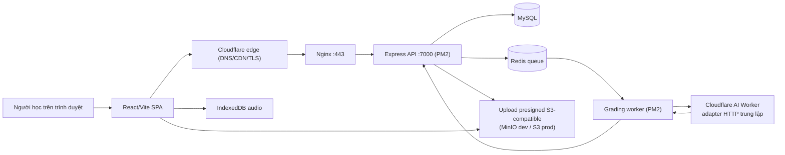

# Mini IELTS Score — TOEIC Speaking/Writing AI Lab


Tên repo vẫn là Mini IELTS Score, nhưng source hiện tại không còn là một app chấm IELTS Writing đơn giản. Trạng thái thật trong code là **ANISH TOEIC Speaking & Writing Lab**: công cụ luyện TOEIC Speaking/Writing trên trình duyệt, cho phép chọn câu, dán đề, tải ảnh đề, ghi âm câu trả lời, rồi gửi sang Cloudflare AI Worker để chấm điểm.

Ứng dụng được triển khai theo một luồng duy nhất:

- **VPS**: Nginx reverse proxy + Express API (`anish-toeic-web-services`) và grading worker quản lý bằng PM2, phía sau Cloudflare edge (DNS/CDN/TLS).
- **Chấm điểm**: worker gọi Cloudflare AI Worker qua HTTP bằng adapter trung lập với nhà cung cấp (`CLOUDFLARE_AI_WORKER_URL`/`TOKEN`); `AI_GRADING_TEST_MODE=true` thay bằng test double xác định cho dev/test.


## Mục Lục

1. [Ứng dụng giải quyết gì](#ứng-dụng-giải-quyết-gì)
2. [Bề mặt hiện tại](#bề-mặt-hiện-tại)
3. [Tech Stack](#tech-stack)
4. [Kiến trúc](#kiến-trúc)
5. [Mô hình chấm điểm](#mô-hình-chấm-điểm)
6. [Chạy local](#chạy-local)
7. [Tài liệu chi tiết](#tài-liệu-chi-tiết)
8. [Lưu ý vận hành](#lưu-ý-vận-hành)

## Ứng Dụng Giải Quyết Gì

Luồng chính của app là mô phỏng môi trường luyện TOEIC Speaking/Writing có AI hỗ trợ chấm điểm. Người học không chỉ gõ một bài viết rồi nhận điểm; họ phải chọn phần thi, nhập đúng đề đang làm, bổ sung ảnh đề nếu câu yêu cầu, làm bài trong timer, rồi nhận phản hồi chi tiết theo rubric.

Với **Speaking**, người học chọn tối đa 11 câu thuộc 5 part TOEIC Speaking. App điều khiển thời gian chuẩn bị, thời gian ghi âm, lưu audio trong IndexedDB, và gửi audio/transcript lên backend để transcription + grading.

Với **Writing**, người học chọn tối đa 8 câu thuộc 3 part TOEIC Writing. App hỗ trợ ảnh cho câu tranh/email, timer theo part, word count, lưu câu trả lời, và gửi text + image context để chấm theo cấu trúc JSON.

Điểm quan trọng: app giữ nhiều state ở trình duyệt. Audio không lưu vào `localStorage` vì quota quá nhỏ; source dùng **IndexedDB** trong `src/lib/audioStorage.ts`.

## Bề Mặt Hiện Tại

| Bề mặt | Source | Ghi chú |
|---|---|---|
| Shell chính | `anish-toeic-web-app/src/App.tsx`, `Header.tsx` | Chọn tab Speaking/Writing sau khi đăng nhập. |
| Chọn câu Speaking | Catalog từ DB qua `GET /api/toeic-exams` | 11 câu, 5 part, tick từng câu hoặc cả part. |
| Chọn câu Writing | Catalog từ DB qua `GET /api/toeic-exams` | 8 câu, 3 part, timer theo part/câu. |
| Xác thực | `POST /api/auth/login` | Phiên qua HttpOnly cookie (JWT + thu hồi `jti` trong Redis); không có token trong body hay `localStorage`. |
| Chấm điểm | `anish-toeic-web-services` `src/workers/grading.worker.ts`, `src/services/adapters/ai-grading.adapter.ts` | Worker queue gọi Cloudflare AI Worker qua HTTP; `AI_GRADING_TEST_MODE=true` dùng test double xác định. |
| Media | `media.adapter.ts`, `POST /api/toeic-attempts/:id/media/presign` | Upload presigned tương thích S3 (MinIO local cho dev). |
| Triển khai VPS | `anish-toeic-web-services`, `nginx/nginx.conf`, `ecosystem.config.cjs` | Express + PM2 trên VPS phía sau Cloudflare edge. |


## Tech Stack

| Layer | Stack | Vai trò trong dự án |
|---|---|---|
| Frontend |    | SPA cho hai flow luyện thi, cần tương tác nhanh với timer, audio recorder, upload ảnh. |
| UI |   | Layout card, tab, trạng thái ghi âm, modal hướng dẫn, theme toggle. |
| AI |  | Chấm qua Cloudflare AI Worker bằng HTTP; adapter trung lập với test double xác định (`AI_GRADING_TEST_MODE`). |
| Browser Storage |  | Audio blob nằm trong IndexedDB; token xác thực không bao giờ vào web storage (HttpOnly cookie). |
| API |  | Express API (`anish-toeic-web-services`) + grading worker trên VPS. |
| Vận hành |   | Nginx reverse proxy + PM2 trên VPS phía sau Cloudflare edge. |

## Kiến Trúc



Quyết định cốt lõi của repo là để trình duyệt điều khiển bài làm, còn backend là ranh giới chấm điểm. Backend quản lý xác thực, attempt và queue chấm điểm; media được upload thẳng lên S3-compatible qua presigned URL nên audio/ảnh đề không đi qua Nginx.

## Mô Hình Chấm Điểm

Grading worker gửi từng attempt tới Cloudflare AI Worker và chuẩn hóa JSON trả về trước khi lưu kết quả.

| Kỹ năng | Cấu trúc | Điểm tối đa | Source |
|---|---:|---:|---|
| Speaking | 5 part, 11 câu | 200 | `anish-toeic-web-services/src/services/grading.service.ts` |
| Writing | 3 part, 8 câu | 200 | `anish-toeic-web-services/src/services/grading.service.ts` |

Chấm điểm đi qua queue Redis: attempt được chấp nhận, đưa vào hàng đợi, worker xử lý và finalize thành một dòng kết quả (điểm + metrics từng câu). Worker gọi AI provider qua HTTP bằng `adapters/ai-grading.adapter.ts`; với `AI_GRADING_TEST_MODE=true` nó dùng test double xác định (không mạng, không ngẫu nhiên). Thiếu cấu hình worker (`CLOUDFLARE_AI_WORKER_URL`/`TOKEN`) và không ở chế độ test thì job fail-closed với `AI_PROVIDER_NOT_CONFIGURED`.

## Chạy Local

Yêu cầu Node.js 22+ (xem `.nvmrc`) và Docker cho hạ tầng dev.

```bash
npm install
npm run dev
```

`npm run dev` chạy cả hai workspace: SPA Vite (`anish-toeic-web-app`, cổng `5173`, proxy `/api` sang `:7000`) và Express API (`anish-toeic-web-services`, cổng `7000`). Khởi động MySQL, Redis và MinIO trước:

```bash
docker compose -f scripts/integration/docker-compose.yml up -d
```

Biến môi trường (copy `env.example` thành `.env`):

```bash
CLOUDFLARE_AI_WORKER_URL=
CLOUDFLARE_AI_WORKER_TOKEN=
AI_GRADING_TEST_MODE=true        # chấm xác định, không gọi AI qua mạng (chỉ dev)
S3_ENDPOINT=http://127.0.0.1:19000  # MinIO local
REDIS_URL=redis://localhost:6379
DB_HOST=localhost
DB_PORT=13306
DB_NAME=anish_toeic
```

`AI_GRADING_TEST_MODE=true` giúp chấm local mà không cần Cloudflare Worker thật; biến này bị cấm ở production (`NODE_ENV=production` fail-fast). Media upload qua presigned URL tới MinIO local. Phiên xác thực dùng HttpOnly cookie — frontend gửi credentials trong mọi request và không lưu token trong `localStorage` hay body JSON.

## Tài Liệu Chi Tiết

- [Đặc tả kỹ thuật](docs/01-technical-specification.md): kiến trúc, storage, model fallback, scoring, deploy boundary.
- [Luồng làm bài](docs/02-exam-workflows.md): flow Speaking/Writing và vòng đời chấm điểm.
- [Vận hành & rủi ro](docs/03-operations-and-risks.md): env, Nginx audio, verification, risk register.

## Lưu Ý Vận Hành

- `npm ci` hiện đang lỗi vì `package-lock.json` chưa đồng bộ với `package.json` ở nhóm dependency Express/CORS. Dùng `npm install` cho tới khi lockfile được sửa trong một commit dependency riêng.
- Một số comment và chuỗi UI trong source bị mojibake do encoding cũ. Lượt docs này ghi nhận vấn đề nhưng không sửa core UI logic.
- Nội dung cũ của `docs/HTTPS_AUDIO_FIX.md` đã được nhập vào tài liệu vận hành; file cũ vừa trùng thông tin vừa có tên script sai.
- Nhóm file `assets/c__Users_Lenovo_...png` là artifact từ workspace editor, không phải asset của app, nên được loại khỏi cấu trúc tài liệu.
