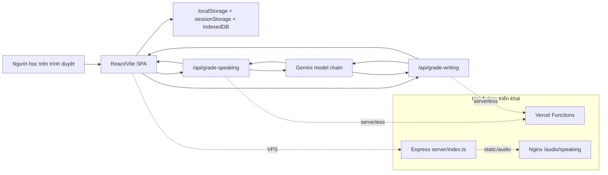

# Mini IELTS Score — TOEIC Speaking/Writing AI Lab


Tên repo vẫn là Mini IELTS Score, nhưng source hiện tại không còn là một app chấm IELTS Writing đơn giản. Trạng thái thật trong code là **ANISH TOEIC Speaking & Writing Lab**: công cụ luyện TOEIC Speaking/Writing trên trình duyệt, cho phép chọn câu, dán đề, tải ảnh đề, ghi âm câu trả lời, rồi gửi sang Gemini để chấm điểm.

Ứng dụng đang có hai hướng triển khai:

- **Vercel serverless** qua `api/grade-speaking.ts` và `api/grade-writing.ts`.
- **VPS/Express** qua `server/index.ts`, các script triển khai, và cấu hình Nginx phục vụ audio tĩnh.


## Mục Lục

1. [Ứng dụng giải quyết gì](#ứng-dụng-giải-quyết-gì)
2. [Bề mặt hiện tại](#bề-mặt-hiện-tại)
3. [Tech Stack](#tech-stack)
4. [Kiến trúc](#kiến-trúc)
5. [Mô hình chấm điểm](#mô-hình-chấm-điểm)
6. [Chạy local](#chạy-local)
7. [Tài liệu chi tiết](#tài-liệu-chi-tiết)
8. [Lưu ý vận hành](#lưu-ý-vận-hành)

## Ứng Dụng Giải Quyết Gì

Luồng chính của app là mô phỏng môi trường luyện TOEIC Speaking/Writing có AI hỗ trợ chấm điểm. Người học không chỉ gõ một bài viết rồi nhận điểm; họ phải chọn phần thi, nhập đúng đề đang làm, bổ sung ảnh đề nếu câu yêu cầu, làm bài trong timer, rồi nhận phản hồi chi tiết theo rubric.

Với **Speaking**, người học chọn tối đa 11 câu thuộc 5 part TOEIC Speaking. App điều khiển thời gian chuẩn bị, thời gian ghi âm, lưu audio trong IndexedDB, và gửi audio/transcript lên backend để Gemini transcription + grading.

Với **Writing**, người học chọn tối đa 8 câu thuộc 3 part TOEIC Writing. App hỗ trợ ảnh cho câu tranh/email, timer theo part, word count, lưu câu trả lời, và gửi text + image context sang Gemini để chấm theo cấu trúc JSON.

Điểm quan trọng: app giữ nhiều state ở trình duyệt. Audio không lưu vào `localStorage` vì quota quá nhỏ; source dùng **IndexedDB** trong `src/lib/audioStorage.ts`.

## Bề Mặt Hiện Tại

| Bề mặt | Source | Ghi chú |
|---|---|---|
| Shell chính | `src/App.tsx`, `Header.tsx` | Chọn tab Speaking/Writing, mở modal Gemini key. |
| Chọn câu Speaking | `speakingQuestions` trong `src/lib/mockData.ts` | 11 câu, 5 part, tick từng câu hoặc cả part. |
| Chọn câu Writing | `writingQuestions` trong `src/lib/mockData.ts` | 8 câu, 3 part, timer theo part/câu. |
| Gemini key | `src/components/shared/GeminiKeyInput.tsx` | Key người dùng lưu ở `localStorage`; env server là fallback. |
| Chấm Speaking | `api/grade-speaking.ts` | Transcribe audio theo batch, xử lý quota, chuẩn hóa điểm. |
| Chấm Writing | `api/grade-writing.ts` | Chấm text + ảnh, trả criteria/error spans/part scores. |
| Triển khai VPS | `server/index.ts`, `nginx/nginx.conf` | Express serve SPA và API shim; Nginx phục vụ `/audio/speaking`. |


## Tech Stack

| Layer | Stack | Vai trò trong dự án |
|---|---|---|
| Frontend |    | SPA cho hai flow luyện thi, cần tương tác nhanh với timer, audio recorder, upload ảnh. |
| UI |   | Layout card, tab, trạng thái ghi âm, modal hướng dẫn, theme toggle. |
| AI |  | Transcribe audio, chấm multimodal prompt, sinh JSON feedback. |
| Browser Storage |   | Audio blob nằm trong IndexedDB; Gemini key và một phần state nằm trong Web Storage. |
| API |   | Handler chấm điểm chạy được ở Vercel và được bọc lại bởi Express khi deploy VPS. |
| Vận hành |   | Dấu vết triển khai VPS: static audio, reverse proxy, timeout dài cho Gemini. |

## Kiến Trúc



Quyết định cốt lõi của repo là để trình duyệt điều khiển bài làm, còn backend là ranh giới chấm điểm. Cách này làm app nhẹ và dễ deploy, nhưng đổi lại audio, ảnh đề, payload và quota Gemini phải được xử lý cẩn thận.

## Mô Hình Chấm Điểm

Backend yêu cầu Gemini trả JSON có cấu trúc, sau đó normalize điểm trước khi trả cho UI.

| Kỹ năng | Cấu trúc | Điểm tối đa | Source |
|---|---:|---:|---|
| Speaking | 5 part, 11 câu | 200 | `api/grade-speaking.ts` |
| Writing | 3 part, 8 câu | 200 | `api/grade-writing.ts` |

Speaking có batch transcription và xử lý quota. Nếu Gemini hết quota trong lúc transcribe, API có thể trả `incomplete`, `partialTranscripts`, `failedQuestionIds`, và `transcriptsCompleted` để frontend không mất phần đã xử lý.

Writing gửi text cùng ảnh đề qua `generateContentWithMedia`, rồi map điểm từng câu vào trọng số TOEIC Writing: Part 1 tối đa 40, Part 2 tối đa 60, Part 3 tối đa 100.

## Chạy Local

```bash
npm install
npm run dev
```

Chạy API local:

```bash
npm run dev:api
npm run dev:full
```

Biến môi trường:

```bash
GEMINI_API_KEY=your_gemini_api_key
GEMINI_MODEL_CHAIN=gemini-3.0-pro,gemini-2.5-flash,gemini-2.0-flash-exp,gemini-1.5-flash
VITE_AUDIO_BASE_URL=/audio/speaking
```

Người học cũng có thể nhập Gemini key trực tiếp trong modal. Key này lưu ở `localStorage` và được gửi kèm request chấm điểm; `GEMINI_API_KEY` trên server chỉ là fallback.

## Tài Liệu Chi Tiết

- [Đặc tả kỹ thuật](docs/01-technical-specification.md): kiến trúc, storage, model fallback, scoring, deploy boundary.
- [Luồng làm bài](docs/02-exam-workflows.md): flow Speaking/Writing và vòng đời chấm điểm.
- [Vận hành & rủi ro](docs/03-operations-and-risks.md): env, Nginx audio, verification, risk register.

## Lưu Ý Vận Hành

- `npm ci` hiện đang lỗi vì `package-lock.json` chưa đồng bộ với `package.json` ở nhóm dependency Express/CORS. Dùng `npm install` cho tới khi lockfile được sửa trong một commit dependency riêng.
- Một số comment và chuỗi UI trong source bị mojibake do encoding cũ. Lượt docs này ghi nhận vấn đề nhưng không sửa core UI logic.
- Nội dung cũ của `docs/HTTPS_AUDIO_FIX.md` đã được nhập vào tài liệu vận hành; file cũ vừa trùng thông tin vừa có tên script sai.
- Nhóm file `assets/c__Users_Lenovo_...png` là artifact từ workspace editor, không phải asset của app, nên được loại khỏi cấu trúc tài liệu.
