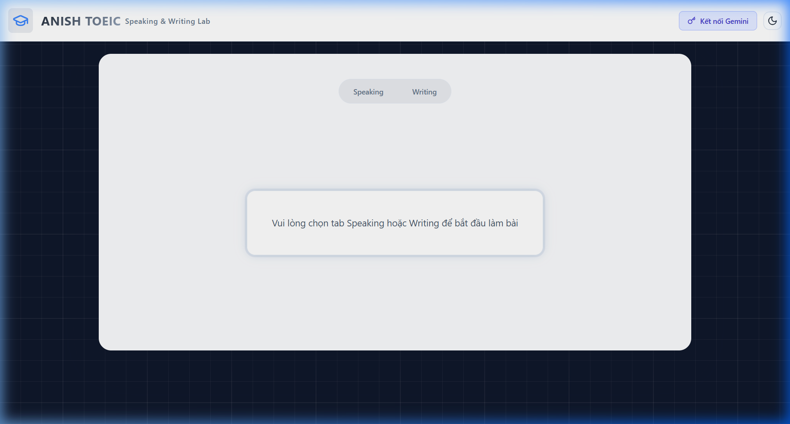
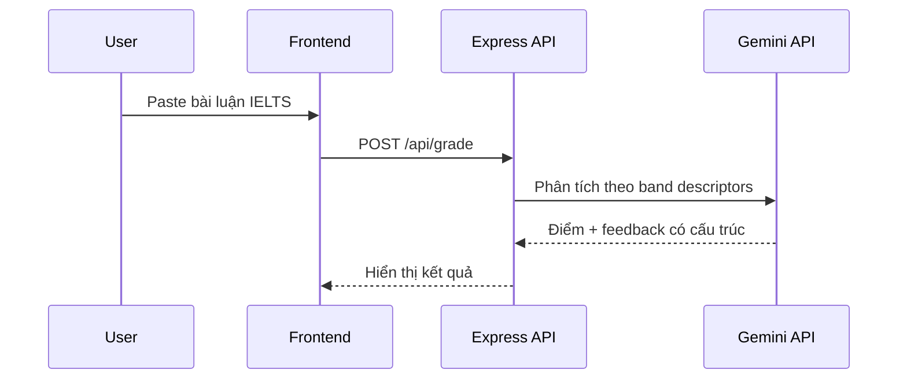

🇬🇧 [Read in English](README.md)

# Mini IELTS Score — Chấm điểm IELTS bằng AI

      

Công cụ chấm điểm IELTS Writing bằng Google Gemini API. Cung cấp band score, nhận xét chi tiết và gợi ý cải thiện — như có giám khảo IELTS cá nhân.

## Xem trước



## Tính năng chính

- **Chấm band score tự động** — IELTS Writing Task 1 & 2
- **Phân tích theo tiêu chí** — Task Response, Coherence, Lexical Resource, Grammar
- **Nhận xét chi tiết** — gợi ý cụ thể để cải thiện
- **Backend Express** — proxy Gemini API, rate limiting, CORS
- **Chế độ Speaking** — ghi âm giọng nói với phát lại audio

## Cách hoạt động



## Cài đặt

```bash
git clone https://github.com/initforge/mini-ielts.score.git
cd mini-ielts.score
cp env.example .env  # Thêm Gemini API key
npm install
npm run dev
```

---

**Xuan Linh** — Fullstack Developer

[](https://github.com/initforge) [](https://linkedin.com/in/linhnx-dev)
