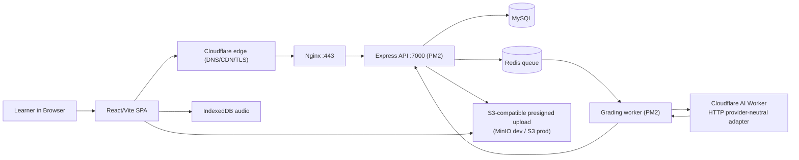

# Mini IELTS Score — TOEIC Speaking/Writing AI Lab


Mini IELTS Score is the repository name, but the current product in source is an **ANISH TOEIC Speaking & Writing Lab**: a browser-based practice tool that lets learners select TOEIC Speaking/Writing questions, paste prompt text, upload prompt images, record answers, and send structured submissions to a Cloudflare AI Worker for scoring.

The app is deployed as a single stack:

- **VPS**: Nginx reverse proxy + PM2-managed Express API (`anish-toeic-web-services`) and a grading worker, behind the Cloudflare edge (DNS/CDN/TLS).
- **Grading**: the worker calls a Cloudflare AI Worker over HTTP through a provider-neutral adapter (`CLOUDFLARE_AI_WORKER_URL`/`TOKEN`); `AI_GRADING_TEST_MODE=true` substitutes a deterministic test double for dev/test.


## Table of Contents

1. [What The App Does](#what-the-app-does)
2. [Current Surface](#current-surface)
3. [Tech Stack](#tech-stack)
4. [Architecture](#architecture)
5. [Scoring Model](#scoring-model)
6. [Run Locally](#run-locally)
7. [Documentation Map](#documentation-map)
8. [Known Operational Notes](#known-operational-notes)

## What The App Does

The current source implements a TOEIC Speaking/Writing practice lab, not a generic IELTS essay grader.

For **Speaking**, the user selects up to 11 TOEIC Speaking questions across 5 parts, pastes the prompt when needed, uploads supporting images for picture/info tasks, records audio in the browser, and submits audio/transcript data to the grading backend. The backend can transcribe missing audio before grading, then returns TOEIC-style scores and Vietnamese feedback.

For **Writing**, the user selects up to 8 TOEIC Writing questions across 3 parts, enters prompt text, uploads images for picture/email prompts, writes responses in timed sections, and submits text plus image context for scoring and error highlighting.

The app intentionally keeps exam state client-side. Speaking audio is stored in **IndexedDB** because browser storage quotas for `localStorage`/`sessionStorage` are too small for recorded blobs.

## Current Surface

| Surface | Evidence | Notes |
|---|---|---|
| Landing shell | `anish-toeic-web-app/src/App.tsx`, `Header.tsx` | User chooses Speaking or Writing after logging in. |
| Speaking selector | Seeded catalog via `GET /api/toeic-exams` | 11 questions, 5 TOEIC parts, configurable selection before starting. |
| Writing selector | Seeded catalog via `GET /api/toeic-exams` | 8 questions, 3 TOEIC parts, timed writing flow. |
| Auth | `POST /api/auth/login` | Session via HttpOnly cookie (JWT + `jti` revocation in Redis); no token in body or `localStorage`. |
| Grading | `anish-toeic-web-services` `src/workers/grading.worker.ts`, `src/services/adapters/ai-grading.adapter.ts` | Queue worker calls Cloudflare AI Worker over HTTP; `AI_GRADING_TEST_MODE=true` uses a deterministic double. |
| Media | `media.adapter.ts`, `POST /api/toeic-attempts/:id/media/presign` | S3-compatible presigned upload (local MinIO for dev). |
| VPS | `anish-toeic-web-services`, `nginx/nginx.conf`, `ecosystem.config.cjs` | Express + PM2 on VPS behind Cloudflare edge. |


## Tech Stack

| Layer | Stack | Why It Exists Here |
|---|---|---|
| Frontend |    | Fast SPA shell for two exam flows and local browser media APIs. |
| Styling |   | Card-based exam UI, timers, animated recording states, theme toggle. |
| AI |  | Grading via Cloudflare AI Worker over HTTP; provider-neutral adapter with a deterministic test double (`AI_GRADING_TEST_MODE`). |
| Browser Storage |  | Audio blobs live in IndexedDB; auth token never touches web storage (HttpOnly cookie). |
| API |  | Express API (`anish-toeic-web-services`) + grading worker on VPS. |
| Operations |   | Nginx reverse proxy + PM2 on VPS behind Cloudflare edge. |

## Architecture



The key design decision is to keep the exam workflow in the browser and use the backend as a grading boundary. The backend owns auth, attempts, and the grading queue; media is uploaded directly to S3-compatible storage via presigned URLs, so audio and prompt images are not proxied through Nginx.

## Scoring Model

The grading worker submits each attempt to the Cloudflare AI Worker and normalizes the returned JSON before persisting results.

| Exam | Parts | Max Score | Source |
|---|---:|---:|---|
| Speaking | 5 parts, 11 questions | 200 | `anish-toeic-web-services/src/services/grading.service.ts` |
| Writing | 3 parts, 8 questions | 200 | `anish-toeic-web-services/src/services/grading.service.ts` |

Grading is queued in Redis: an attempt is accepted, enqueued, processed by the worker, and finalized with a results row (score + per-question metrics). The worker calls the AI provider over HTTP through `adapters/ai-grading.adapter.ts`; with `AI_GRADING_TEST_MODE=true` it uses a deterministic double (no network, no randomness). Without worker config (`CLOUDFLARE_AI_WORKER_URL`/`TOKEN`) and not in test mode, the job fails closed with `AI_PROVIDER_NOT_CONFIGURED`.

## Run Locally

Requires Node.js 22+ (see `.nvmrc`) and Docker for the dev infrastructure.

```bash
npm install
npm run dev
```

`npm run dev` starts both workspaces: the Vite SPA (`anish-toeic-web-app`, port `5173`, proxies `/api` to `:7000`) and the Express API (`anish-toeic-web-services`, port `7000`). Start MySQL, Redis, and MinIO first:

```bash
docker compose -f scripts/integration/docker-compose.yml up -d
```

Environment (copy `env.example` to `.env`):

```bash
CLOUDFLARE_AI_WORKER_URL=
CLOUDFLARE_AI_WORKER_TOKEN=
AI_GRADING_TEST_MODE=true        # deterministic grading, no network AI (dev only)
S3_ENDPOINT=http://127.0.0.1:19000  # local MinIO
REDIS_URL=redis://localhost:6379
DB_HOST=localhost
DB_PORT=13306
DB_NAME=anish_toeic
```

`AI_GRADING_TEST_MODE=true` grades locally without a live Cloudflare Worker; it is forbidden in production (`NODE_ENV=production` fails fast). Media uploads go to local MinIO via presigned URLs. Sessions use HttpOnly cookies — the frontend sends credentials on every request and no token is stored in `localStorage` or the JSON body.

## Documentation Map

- [Technical Specification](docs/01-technical-specification.md) explains architecture, storage, model fallback, scoring, and deployment boundaries.
- [Workflows](docs/02-exam-workflows.md) documents the learner flows for Speaking/Writing and the backend grading lifecycle.
- [Operations & Risk Register](docs/03-operations-and-risks.md) covers environment setup, Nginx audio serving, verification, and current repo risks.

## Known Operational Notes

- `npm ci` currently fails because `package-lock.json` is not synchronized with `package.json` for Express/CORS dependencies. Use `npm install` until the lockfile is repaired in a dependency maintenance commit.
- Several source comments and some UI strings contain mojibake from older encoding issues. This docs pass records the issue but does not modify core UI logic.
- `docs/HTTPS_AUDIO_FIX.md` was folded into the operations doc; the old file had a stale script name and encoding corruption.
- The `assets/c__Users_Lenovo_...png` files were editor workspace artifacts, not app assets, and have been removed from documentation structure.
