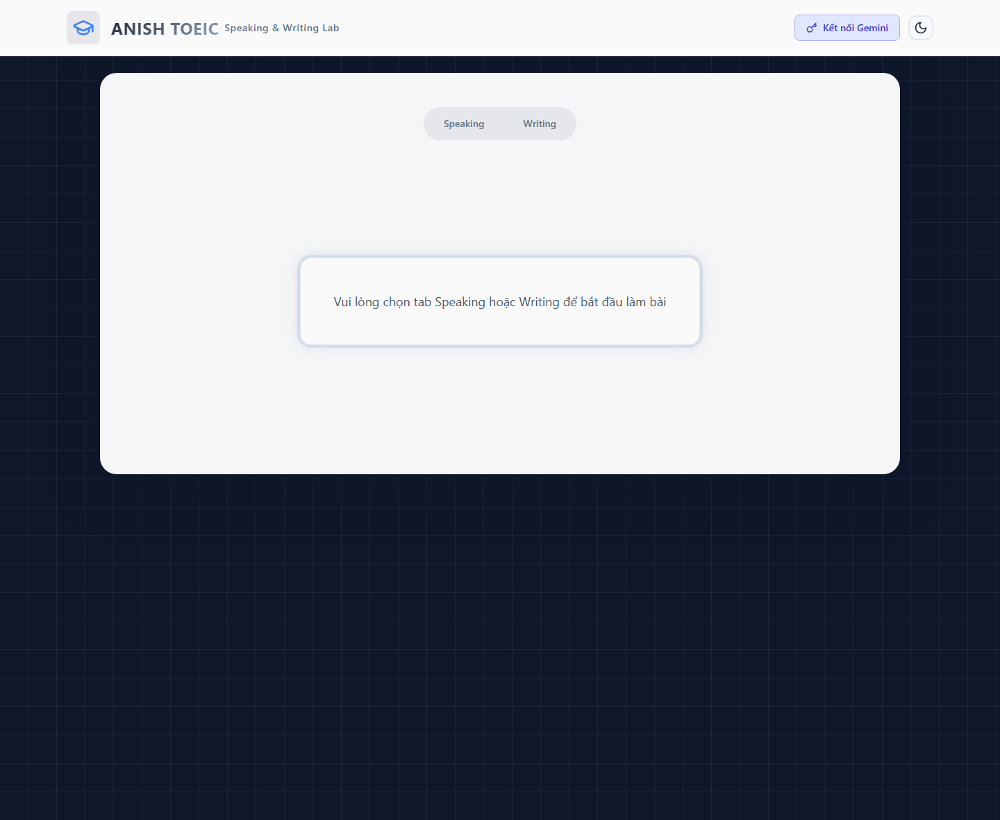
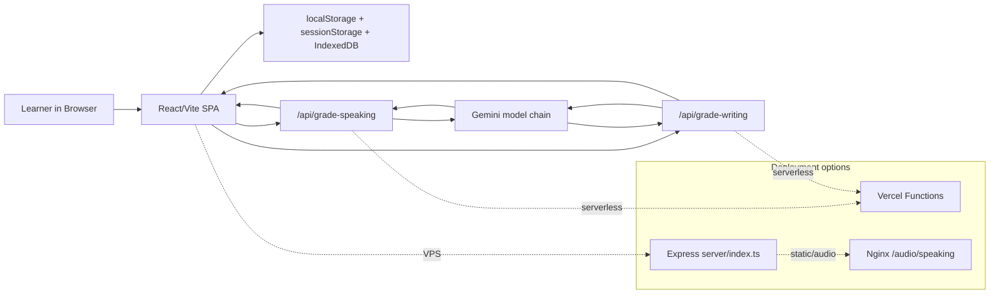

# Mini IELTS Score — TOEIC Speaking/Writing AI Lab


Mini IELTS Score is the repository name, but the current product in source is an **ANISH TOEIC Speaking & Writing Lab**: a browser-based practice tool that lets learners select TOEIC Speaking/Writing questions, paste prompt text, upload prompt images, record answers, and send structured submissions to Gemini for scoring.

The app has two deployment tracks:

- **Vercel serverless** through `api/grade-speaking.ts` and `api/grade-writing.ts`.
- **VPS/Express** through `server/index.ts`, PM2-style scripts, and Nginx audio serving configuration.



## Table of Contents

1. [What The App Does](#what-the-app-does)
2. [Current Surface](#current-surface)
3. [Tech Stack](#tech-stack)
4. [Architecture](#architecture)
5. [Scoring Model](#scoring-model)
6. [Run Locally](#run-locally)
7. [Documentation Map](#documentation-map)
8. [Known Operational Notes](#known-operational-notes)

## What The App Does

The current source implements a TOEIC Speaking/Writing practice lab, not a generic IELTS essay grader.

For **Speaking**, the user selects up to 11 TOEIC Speaking questions across 5 parts, pastes the prompt when needed, uploads supporting images for picture/info tasks, records audio in the browser, and submits audio/transcript data to Gemini. The backend can transcribe missing audio before grading, then returns TOEIC-style scores and Vietnamese feedback.

For **Writing**, the user selects up to 8 TOEIC Writing questions across 3 parts, enters prompt text, uploads images for picture/email prompts, writes responses in timed sections, and submits text plus image context to Gemini for scoring and error highlighting.

The app intentionally keeps exam state client-side. Speaking audio is stored in **IndexedDB** because browser storage quotas for `localStorage`/`sessionStorage` are too small for recorded blobs.

## Current Surface

| Surface | Evidence | Notes |
|---|---|---|
| Landing shell | `src/App.tsx`, `Header.tsx` | User chooses Speaking or Writing after configuring Gemini key. |
| Speaking selector | `speakingQuestions` in `src/lib/mockData.ts` | 11 questions, 5 TOEIC parts, configurable selection before starting. |
| Writing selector | `writingQuestions` in `src/lib/mockData.ts` | 8 questions, 3 TOEIC parts, timed writing flow. |
| Gemini key modal | `src/components/shared/GeminiKeyInput.tsx` | User API key is saved in `localStorage`; server env key is fallback. |
| Serverless grading | `api/grade-speaking.ts`, `api/grade-writing.ts` | Vercel-compatible API handlers. |
| VPS wrapper | `server/index.ts`, `nginx/nginx.conf` | Express serves `dist`, proxies API handler shims, serves audio via Nginx. |


## Tech Stack

| Layer | Stack | Why It Exists Here |
|---|---|---|
| Frontend |    | Fast SPA shell for two exam flows and local browser media APIs. |
| Styling |   | Card-based exam UI, timers, animated recording states, theme toggle. |
| AI |  | Audio transcription, multimodal prompt grading, JSON feedback generation. |
| Browser Storage |   | Audio blobs live in IndexedDB; API key and short state live in web storage. |
| API |   | Same grading handlers support Vercel and a Node/VPS wrapper. |
| Operations |   | Historical/current VPS deployment scripts and audio serving config. |

## Architecture



The key design decision is to keep the exam workflow in the browser and use the backend mainly as a grading boundary. This keeps the app small, but it also means audio, prompt images, and partially completed answers are sensitive to browser storage lifecycle and payload limits.

## Scoring Model

The backend asks Gemini to return strict JSON, then normalizes the result before sending it back to the UI.

| Exam | Parts | Max Score | Source |
|---|---:|---:|---|
| Speaking | 5 parts, 11 questions | 200 | `api/grade-speaking.ts` |
| Writing | 3 parts, 8 questions | 200 | `api/grade-writing.ts` |

Speaking includes batch transcription with rate-limit handling. If Gemini quota is hit during transcription, the API can return partial transcripts and failed question IDs so the frontend can preserve completed work.

Writing can send text plus image context through `generateContentWithMedia`, then maps individual question scores into TOEIC-style part weights.

## Run Locally

```bash
npm install
npm run dev
```

For the local API server:

```bash
npm run dev:api
npm run dev:full
```

Environment:

```bash
GEMINI_API_KEY=your_gemini_api_key
GEMINI_MODEL_CHAIN=gemini-3.0-pro,gemini-2.5-flash,gemini-2.0-flash-exp,gemini-1.5-flash
VITE_AUDIO_BASE_URL=/audio/speaking
```

The UI also allows the learner to paste a Gemini key into the modal. That key is stored in `localStorage` and is sent with grading requests; the server env key is only a fallback.

## Documentation Map

- [Technical Specification](docs/01-technical-specification.md) explains architecture, storage, model fallback, scoring, and deployment boundaries.
- [Workflows](docs/02-exam-workflows.md) documents the learner flows for Speaking/Writing and the backend grading lifecycle.
- [Operations & Risk Register](docs/03-operations-and-risks.md) covers environment setup, Nginx audio serving, verification, and current repo risks.

## Known Operational Notes

- `npm ci` currently fails because `package-lock.json` is not synchronized with `package.json` for Express/CORS dependencies. Use `npm install` until the lockfile is repaired in a dependency maintenance commit.
- Several source comments and some UI strings contain mojibake from older encoding issues. This docs pass records the issue but does not modify core UI logic.
- `docs/HTTPS_AUDIO_FIX.md` was folded into the operations doc; the old file had a stale script name and encoding corruption.
- The `assets/c__Users_Lenovo_...png` files were editor workspace artifacts, not app assets, and have been removed from documentation structure.
