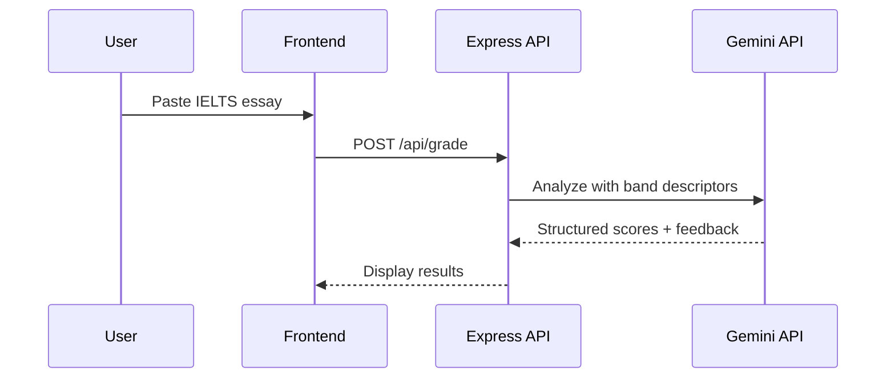

🇻🇳 [Đọc bằng tiếng Việt](README-vi.md)

# Mini IELTS Score — AI Writing Grader

      

An AI-powered IELTS writing assessment tool that grades essays using Google Gemini API. Provides band scores, detailed feedback, and improvement suggestions — like having a personal IELTS examiner.

## Preview


## What it does

- **Automated band scoring** — grades IELTS Writing Task 1 & 2
- **Criterion breakdown** — Task Response, Coherence, Lexical Resource, Grammar
- **Detailed feedback** — specific suggestions for improvement
- **Express backend** — API proxy for Gemini, rate limiting, CORS
- **Speaking test mode** — voice recording with audio playback

## How it works



## Getting started

```bash
git clone https://github.com/initforge/mini-ielts.score.git
cd mini-ielts.score
cp env.example .env  # Add your Gemini API key
npm install
npm run dev
```

---

**Xuan Linh** — Fullstack Developer

[](https://github.com/initforge) [](https://linkedin.com/in/linhnx-dev)
