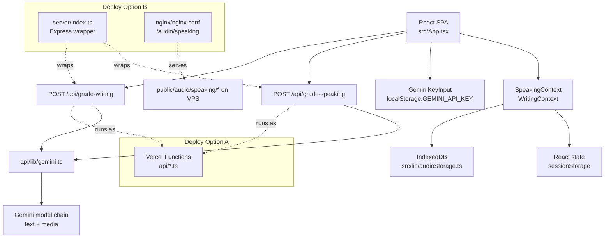

# Technical Specification — TOEIC Speaking/Writing AI Lab

> Updated: 2026-05-26
> Source basis: `src/App.tsx`, `src/contexts/*`, `src/components/*`, `api/*`, `server/*`, `nginx/*`, `scripts/*`

This document explains the current implementation, including historical naming drift. The repository is named `mini-ielts.score`, but the current source operates as an **ANISH TOEIC Speaking & Writing Lab**.

## 1. Product Boundary

The app is a single-page TOEIC practice tool with two exam modes:

| Mode | Questions | Parts | Main input | AI operation |
|---|---:|---:|---|---|
| Speaking | 11 | 5 | Microphone audio, prompt text, optional prompt image | Transcription + structured scoring |
| Writing | 8 | 3 | Written answer, prompt text, optional prompt image | Multimodal grading + error spans |

The app does not persist users, sessions, submissions, or scores in a database. It is intentionally browser-first:

- question selection is local state;
- writing answers are React state/session storage;
- speaking audio uses IndexedDB;
- Gemini key can be user-provided through the UI;
- backend routes are stateless grading boundaries.

## 2. Architecture



### Why the backend is thin

The backend does not own an exam lifecycle. It receives a completed or partially completed submission, calls Gemini, normalizes the response, and returns a result. This keeps deployment simple, but it also means the frontend must guard user work against reloads, media permission failures, and browser storage cleanup.

### Why IndexedDB is used for Speaking

Recorded audio is too large for reliable `localStorage`/`sessionStorage`. `src/lib/audioStorage.ts` stores blobs as `ArrayBuffer` in IndexedDB under the `toeic-audio-storage` database and `audio-recordings` object store. Each entry is keyed by `questionId`.

This design solves the practical problem of switching questions without losing recorded answers, but it is still local to the browser. There is no cross-device restore.

## 3. Source Map

| Area | Files | Responsibility |
|---|---|---|
| App shell | `src/App.tsx`, `src/components/shared/Header.tsx` | Tab switching, Gemini key modal, provider wiring, grading actions. |
| Speaking state | `src/contexts/SpeakingContext.tsx` | Selected questions, current question, answer list, prompt overrides, image data, audio URLs. |
| Writing state | `src/contexts/WritingContext.tsx` | Selected questions, timers, active part lock, answers, prompt/image overrides. |
| Question bank | `src/lib/mockData.ts` | Static TOEIC Speaking/Writing question metadata and sample prompts. |
| Audio recording | `src/components/speaking/AudioRecorder.tsx` | `getUserMedia`, `MediaRecorder`, codec selection, hard stop, playback, IndexedDB restore. |
| Audio URLs | `src/lib/speakingAudio.ts` | `VITE_AUDIO_BASE_URL` mapping for beep/instruction audio. |
| Gemini client | `api/lib/gemini.ts` | Model chain, transcription, multimodal request, JSON cleanup, Gemini error mapping. |
| Speaking grading | `api/grade-speaking.ts` | Batch transcription, quota partial result, TOEIC Speaking scoring normalization. |
| Writing grading | `api/grade-writing.ts` | Writing rubric prompt, image-aware grading, part score normalization. |
| VPS server | `server/index.ts` | Express static server and API handler shim. |
| Dev API server | `server/dev-server.ts` | Local API server on port `4000` for Vite proxy. |
| Nginx | `nginx/nginx.conf`, `nginx/audio-config.conf` | HTTPS reverse proxy, `/audio/speaking/` static serving, long API timeouts. |

## 4. Gemini Model Strategy

`api/lib/gemini.ts` supports model fallback rather than a single hardcoded model.

Text generation chain:

```text
GEMINI_MODEL_CHAIN
GEMINI_MODEL
gemini-3.0-pro
gemini-2.5-flash
gemini-2.0-flash-exp
gemini-1.5-flash
gemini-1.5-pro
gemini-1.5-flash-8b
gemini-1.0-pro
```

Transcription chain:

```text
GEMINI_TRANSCRIBE_MODEL_CHAIN
GEMINI_TRANSCRIBE_MODEL
then the text model chain
```

The request key precedence is:

1. API key sent by the frontend request.
2. `process.env.GEMINI_API_KEY`.

Important behavior:

- 404/503 can fall through to the next model candidate.
- 400 invalid key, 403 permission, and 429 quota/rate limit are mapped to explicit codes.
- Gemini response text is cleaned before JSON parsing because model output may include Markdown fences.

## 5. Speaking Scoring

Source: `api/grade-speaking.ts`

### Question structure

| Part | Questions | Skill | Timing evidence |
|---|---:|---|---|
| 1 | Q1-Q2 | Read aloud | 45s prepare, 47s response in `mockData.ts` |
| 2 | Q3-Q4 | Describe picture | 30s prepare, 32s response |
| 3 | Q5-Q7 | Respond to questions | 3s prepare, 17s response |
| 4 | Q8-Q10 | Respond using information | 3s/15s prepare, 32s response |
| 5 | Q11 | Express opinion | 15s prepare, 62s response |

### Score weights

| Part | Max contribution |
|---|---:|
| Part 1 | 20 |
| Part 2 | 20 |
| Part 3 | 40 |
| Part 4 | 60 |
| Part 5 | 30 |

The overall score is normalized to a 200-point scale. The API asks Gemini for per-question scoring and criteria feedback, then clamps and normalizes output before returning it.

### Transcription batching

Constants in source:

```text
BATCH_SIZE = 6
BATCH_DELAY_MS = 60000
RATE_LIMIT_RETRY_DELAY_MS = 5000
RATE_LIMIT_MAX_RETRIES = 2
```

Why this exists:

- Speaking answers may contain 11 audio blobs.
- Sending all audio at once risks quota/rate-limit failures.
- The API can return partial progress instead of losing all transcription work.

Partial quota response fields:

```text
incomplete
code = QUOTA_EXCEEDED
partialTranscripts
failedQuestionIds
transcriptsCompleted
```

This is one of the stronger engineering decisions in the repo: the failure mode is explicit and recoverable.

## 6. Writing Scoring

Source: `api/grade-writing.ts`

### Question structure

| Part | Questions | Task | Max contribution |
|---|---:|---|---:|
| 1 | Q1-Q5 | Write one sentence about a picture | 40 |
| 2 | Q6-Q7 | Respond to an email | 60 |
| 3 | Q8 | Opinion essay | 100 |

The frontend no longer enforces minimum word count as a hard blocker; `WritingTab.tsx` treats word count as informational. The backend still sends the answer and prompt context to Gemini for grading.

### Image handling

Writing supports images through:

- `setQuestionImage(questionId, imageData)` for Part 1;
- `setPartImage(2, imageData)` for Part 2 shared email prompt image.

The backend uses `generateContentWithMedia` for image-aware grading. This matters because TOEIC Writing Part 1/2 often depends on visual or email prompt context.

## 7. Storage & Privacy Boundaries

| Data | Location | Lifetime |
|---|---|---|
| Gemini API key | `localStorage.GEMINI_API_KEY` | Until user removes it or clears browser data. |
| Writing exam state | `sessionStorage.toeic-writing-exam-state` | Current browser session; reset on fresh provider load. |
| Instruction flags | `sessionStorage.toeic-writing-shown-instructions` | Current browser session; reset on fresh provider load. |
| Speaking audio | IndexedDB `toeic-audio-storage` | Cleared on fresh Speaking provider load and reset. |
| Grading result | React state | Current runtime only. |

The repo does not include server-side encryption, user auth, or submission history. If this becomes a real multi-user product, those need to be added deliberately rather than assumed.

## 8. Deployment Modes

### Vercel

`vercel.json`:

```json
{
  "buildCommand": "npm run build",
  "outputDirectory": "dist",
  "rewrites": [{ "source": "/api/(.*)", "destination": "/api/$1" }]
}
```

This is the cleaner path for the current architecture because the API handlers already match Vercel's request/response shape.

### VPS / Express

`server/index.ts` serves `dist` and exposes:

- `GET /health`
- `POST /api/grade-speaking`
- `POST /api/grade-writing`

The Express wrapper adapts Vercel handlers into an Express-like response object. Nginx then handles HTTPS, reverse proxy, static assets, and audio files.

Why this path exists:

- browser microphone requires HTTPS outside localhost;
- static instruction audio must be served with correct MIME;
- Gemini calls can run long, so Nginx timeout is raised to 300 seconds.

## 9. Current Quality Gaps

| Gap | Evidence | Impact |
|---|---|---|
| Lockfile drift | `npm ci` fails because `package-lock.json` lacks current Express/CORS deps | CI or clean deploy can fail until lockfile is repaired. |
| Encoding corruption in source | Many Vietnamese strings appear as mojibake in TS/MD/scripts | UI text and operator docs can look unprofessional. |
| Product naming drift | Repo/old README says IELTS; source says TOEIC | Docs, deployment, and users may describe the wrong product. |
| Static audio deployment split | `public/audio` is empty locally; `audio-temp` + scripts upload files to VPS | Vercel/local static audio may be incomplete unless audio files are provisioned. |
| No persisted backend submissions | No database layer | Good for practice lab; insufficient for real learner history/admin analytics. |
