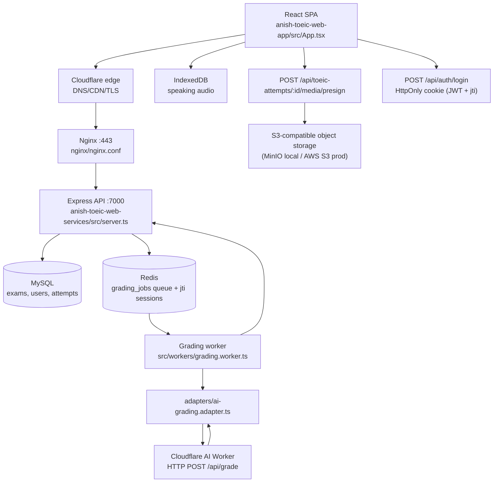

# Technical Specification — TOEIC Speaking/Writing AI Lab

> Updated: 2026-08-01 (R3-DOCS-FIX — legacy third-party grading surface removed)
> Source basis: `anish-toeic-web-app/src/*`, `anish-toeic-web-services/src/*`, `nginx/*`, `ecosystem.config.cjs`

This document explains the current implementation, including historical naming drift. The repository is named `mini-ielts.score`, but the current source operates as an **ANISH TOEIC Speaking & Writing Lab**.

## 1. Product Boundary

The app is a single-page TOEIC practice tool with two exam modes:

| Mode | Questions | Parts | Main input | AI operation |
|---|---:|---:|---|---|
| Speaking | 11 | 5 | Microphone audio, prompt text, optional prompt image | Transcription + structured scoring |
| Writing | 8 | 3 | Written answer, prompt text, optional prompt image | Multimodal grading + error spans |

The app keeps the exam workflow browser-first:

- the exam catalog and questions are served from the backend (seeded MySQL) via `GET /api/toeic-exams`;
- speaking audio uses IndexedDB until uploaded to S3-compatible storage via presigned URLs;
- answers are React state, then persisted server-side as attempts once submitted;
- auth is session-based: JWT in an HttpOnly cookie with `jti` revocation in Redis — no token in `localStorage` or request bodies;
- grading is asynchronous: attempts enqueue a `grading_jobs` row, and a worker calls the AI provider over HTTP.

## 2. Architecture



### Why the backend is thin

The backend owns auth, attempts, media presigning, and the grading queue, but not the exam lifecycle. A submission becomes a `grading_jobs` row; the worker polls `QUEUED`/`RETRY` jobs every 5s, calls the AI provider through the adapter, and finalizes the attempt with a results row. The adapter is provider-neutral — the only coupling is the HTTP contract `CLOUDFLARE_AI_WORKER_URL`/`TOKEN` (`POST /api/grade`), and `AI_GRADING_TEST_MODE=true` substitutes a deterministic double with no network access and no randomness.

### Why IndexedDB is used for Speaking

Recorded audio is too large for reliable `localStorage`/`sessionStorage`. `anish-toeic-web-app/src/modules/mock-exam/lib/attemptStorage.ts` stores pending attempts and audio snapshots as blobs in IndexedDB, so recordings survive tab reloads and question switches. Media is uploaded to S3-compatible storage via presigned URLs when the attempt is submitted.

This design solves the practical problem of switching questions without losing recorded answers. Storage is local to the browser until the attempt is submitted; there is no cross-device restore.

## 3. Source Map

| Area | Files | Responsibility |
|---|---|---|
| App shell | `anish-toeic-web-app/src/App.tsx`, `pages/user/*` | Routing, provider wiring, login, catalog, runner, history, result pages. |
| Exam runner | `anish-toeic-web-app/src/modules/mock-exam/runner/{lr,sw}/*` | TOEIC Listening/Reading and Speaking/Writing timed flows. |
| Attempt storage | `anish-toeic-web-app/src/modules/mock-exam/lib/attemptStorage.ts` | IndexedDB persistence for pending attempts and audio before submit. |
| API client | `anish-toeic-web-app/src/api.ts` | Axios client, `withCredentials`, no token in body/localStorage. |
| Auth | `anish-toeic-web-services/src/routes/auth.routes.ts`, `src/middlewares/auth.middleware.ts` | Login/register/logout, HttpOnly cookie JWT, `jti` session revocation in Redis. |
| Attempts & media | `anish-toeic-web-services/src/routes/toeic.routes.ts`, `src/services/{toeic,media}.service.ts` | Attempt lifecycle, `POST /api/toeic-attempts/:id/media/presign` (S3-compatible presigned URLs). |
| Grading queue | `anish-toeic-web-services/src/services/grading.service.ts` | `grading_jobs` state machine (QUEUED → PROCESSING → COMPLETED/PARTIAL/FAILED → RETRY), idempotency, sanitized errors. |
| AI adapter | `anish-toeic-web-services/src/services/adapters/ai-grading.adapter.ts` | Provider-neutral HTTP adapter (`CLOUDFLARE_AI_WORKER_URL`/`TOKEN`) + deterministic test double (`AI_GRADING_TEST_MODE`). |
| Scorer | `anish-toeic-web-services/src/services/scorer.service.ts` | Score normalization and aggregation. |
| Grading worker | `anish-toeic-web-services/src/workers/grading.worker.ts` | Polls `QUEUED`/`RETRY` jobs every 5s, calls the adapter, finalizes attempts. |
| API server | `anish-toeic-web-services/src/server.ts` | Express entry point on port `7000`; `TRUST_PROXY` gate, rate limits, CSP-safe headers. |
| Nginx | `nginx/nginx.conf`, `nginx/audio-config.conf` | HTTPS reverse proxy `/api/` → `:7000`, SPA + `/assets/` static, 300s API timeouts, security headers. |
| PM2 | `ecosystem.config.cjs` | Two apps: web service and grading worker. |

## 4. AI Grading: Cloudflare AI Worker Adapter

Grading never calls a model provider directly from Express. The worker talks to a Cloudflare AI Worker over HTTP through a provider-neutral adapter (`anish-toeic-web-services/src/services/adapters/ai-grading.adapter.ts`):

- **Production**: `CLOUDFLARE_AI_WORKER_URL` + `CLOUDFLARE_AI_WORKER_TOKEN` — the adapter POSTs the submission to `${CLOUDFLARE_AI_WORKER_URL}/api/grade` with the token in an authorization header, bounded by `CLOUDFLARE_AI_TIMEOUT_MS`.
- **Test/dev**: `AI_GRADING_TEST_MODE=true` — `createTestAiGradingAdapter` returns a deterministic double (fixed rubric scores, no network, no `Math.random`). Never set in production; the zod env schema fails fast if `NODE_ENV=production` and `AI_GRADING_TEST_MODE=true`.
- **Fail-closed**: with no worker URL/token and test mode off, `getAiGradingAdapter` throws `AiProviderNotConfiguredError`; jobs fail with `AI_PROVIDER_NOT_CONFIGURED` and are not retried.

Error mapping:

- retryable provider errors (`AiProviderRetryableError`, `AiProviderTimeoutError`) mark the job `RETRY`;
- non-retryable errors (invalid request, auth, 4xx contract violations) mark the job `FAILED` immediately;
- errors are sanitized before any response leaves the service.

The model choice and prompt construction live on the Cloudflare Worker side; the Express service only consumes the contract (`{ scores, criteria, ... }` JSON) and normalizes it.

## 5. Speaking Scoring

Source: `anish-toeic-web-services/src/services/grading.service.ts` + `src/services/scorer.service.ts`

### Question structure

| Part | Questions | Skill | Timing evidence |
|---|---:|---|---|
| 1 | Q1-Q2 | Read aloud | 45s prepare, 47s response in `mockData.ts` |
| 2 | Q3-Q4 | Describe picture | 30s prepare, 32s response |
| 3 | Q5-Q7 | Respond to questions | 3s prepare, 17s response |
| 4 | Q8-Q10 | Respond using information | 3s/15s prepare, 32s response |
| 5 | Q11 | Express opinion | 15s prepare, 62s response |

### Score weights

| Part | Max contribution |
|---|---:|
| Part 1 | 20 |
| Part 2 | 20 |
| Part 3 | 40 |
| Part 4 | 60 |
| Part 5 | 30 |

The overall score is normalized to a 200-point scale. The grading worker asks the AI provider (via the adapter) for per-question scoring and criteria feedback, then clamps and normalizes the output before persisting a results row.

### Queue-based grading

Speaking and Writing share the same pipeline; there is no synchronous, per-request AI call:

- submissions create a `grading_jobs` row (`QUEUED`);
- the worker polls `QUEUED`/`RETRY` jobs every 5s (`grading.worker.ts`);
- per-question scores are persisted iteratively, so partial progress survives a mid-job failure (`PARTIAL`);
- retryable provider errors (timeout, 5xx) re-enqueue with a retry counter; non-retryable errors mark the job `FAILED`;
- idempotency keys prevent duplicate scoring on retry.

### Partial persistence

A job that fails partway keeps already-saved question scores and records status `PARTIAL`, so the learner's completed answers are not lost. On finalization, `finalizeCompleted` always writes a results row — including an all-zero row when the attempt had no responses — so a `COMPLETED` job never 404s the result endpoint.

## 6. Writing Scoring

Source: `anish-toeic-web-services/src/services/grading.service.ts` + `src/services/scorer.service.ts`

### Question structure

| Part | Questions | Task | Max contribution |
|---|---:|---|---:|
| 1 | Q1-Q5 | Write one sentence about a picture | 40 |
| 2 | Q6-Q7 | Respond to an email | 60 |
| 3 | Q8 | Opinion essay | 100 |

The frontend no longer enforces minimum word count as a hard blocker; the Writing runner treats word count as informational. The grading worker still sends the answer and prompt context to the AI provider for scoring.

### Image handling

Writing supports images through the runner's answer state:

- Part 1 image (`q1` picture);
- Part 2 shared email prompt image.

Images (and speaking audio) are uploaded to S3-compatible storage via presigned URLs (`POST /api/toeic-attempts/:id/media/presign`) before submission; the worker passes the stored media references to the AI provider. This matters because TOEIC Writing Part 1/2 often depends on visual or email prompt context.

## 7. Storage & Privacy Boundaries

| Data | Location | Lifetime |
|---|---|---|
| Session | HttpOnly `auth_token` cookie (JWT with `jti`) | Cookie lifetime = `JWT_EXPIRES_IN`; `jti:<id>` in Redis, deleted on logout (instant revocation). |
| User accounts | MySQL (`users`) | Server-side; password hashed, no plaintext. |
| Attempts & results | MySQL (`toeic_attempts`, `toeic_attempt_results`, `grading_jobs`) | Server-side; owned by `user_id`, queryable from history. |
| Pending exam state | IndexedDB (`attemptStorage.ts`) | Local until submitted; cleared on submission/reset. |
| Audio & prompt images | S3-compatible storage via presigned URLs | Media objects in MinIO/S3; URLs expire after upload. |

Auth never touches `localStorage` or JSON bodies: the frontend sends credentials with every request (`withCredentials`), the cookie is `HttpOnly` + `SameSite=Lax` (+ `Secure` in production), and logout revokes the `jti` server-side. Rate-limit identity uses `cf-connecting-ip` only when `TRUST_PROXY=true` (i.e. behind nginx/Cloudflare), validated via `net.isIP`.

## 8. Deployment

Single deployment: nginx + PM2 on a VPS behind the Cloudflare edge (DNS/CDN/TLS, full-strict origin HTTPS). Serverless edge deployment is not used.

### Topology

```
Browser (HTTPS)
  -> Cloudflare edge (DNS/CDN/TLS)
  -> Nginx :443 (nginx/nginx.conf)
       /api/      -> proxy_pass http://node_backend (127.0.0.1:7000)
       /assets/*  -> alias anish-toeic-web-app/dist/assets (immutable, 1y)
       /*         -> SPA fallback dist/index.html (no-cache)
PM2 (ecosystem.config.cjs)
  - anish-toeic-web-services -> node dist/server.js :7000
  - toeic-grading-worker     -> node dist/workers/grading.worker.js
```

### Why nginx + PM2 on VPS

- browser microphone requires HTTPS outside localhost (Cloudflare edge + origin cert);
- `/api/` reverse proxy to Express `:7000` with 300s read/send timeouts (grading and submission can exceed 2 minutes);
- static `/assets/` caching for the Vite build;
- security headers (CSP, HSTS, XFO, nosniff) at server level;
- PM2 keeps the API and the grading worker alive with `autorestart` and `max_memory_restart`.

### External dependencies

- **Cloudflare AI Worker** (`CLOUDFLARE_AI_WORKER_URL`/`TOKEN`) for grading — optional at boot; absent + test mode off ⇒ jobs fail closed with `AI_PROVIDER_NOT_CONFIGURED`.
- **S3-compatible storage** (`S3_ENDPOINT`/`S3_BUCKET`/`S3_ACCESS_KEY`/`S3_SECRET_KEY`, or AWS vars) for media presigning — absent ⇒ presign endpoint returns 503.
- **MySQL + Redis** are required (attempts/results and the grading queue + `jti` sessions).

## 9. Current Quality Gaps

| Gap | Evidence | Impact |
|---|---|---|
| Encoding corruption in source | Many Vietnamese strings appear as mojibake in TS/MD/scripts | UI text and operator docs can look unprofessional. |
| Product naming drift | Repo/old README says IELTS; source says TOEIC | Docs, deployment, and users may describe the wrong product. |
| FE bundle size | Main bundle ≈ 1.8 MB (Vite chunk-size warning) | Non-blocking; code-splitting pass recommended. |
| External deps not live-proven | Cloudflare AI Worker and AWS S3 were never exercised against a live account (dev runs on `AI_GRADING_TEST_MODE` + MinIO) | Deployment must verify the real adapter + presign paths once credentials exist. |
| Media/audio provisioning | Prompt images and instruction audio must be present in MinIO/S3 | Missing objects fail media loads after deploy until provisioned. |
