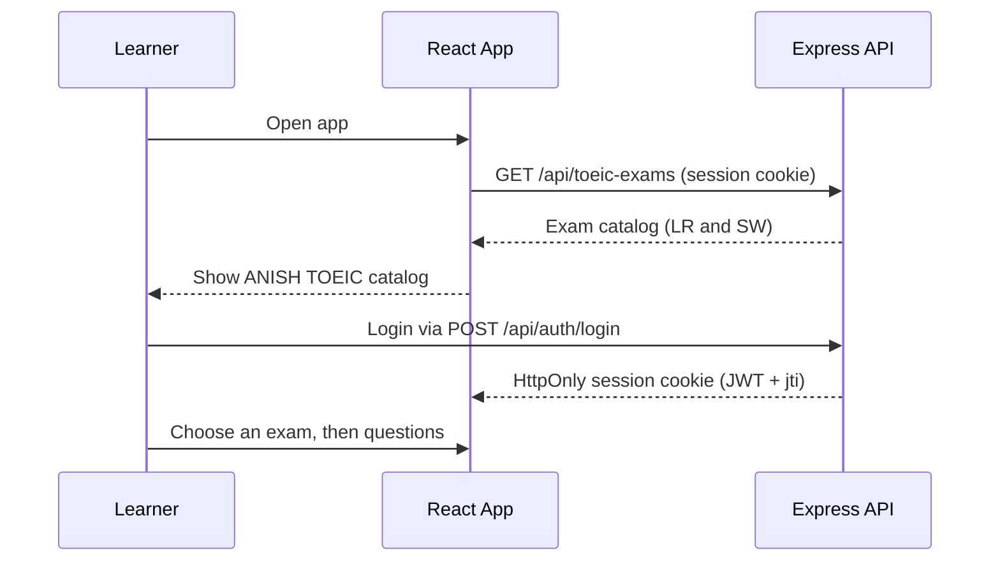
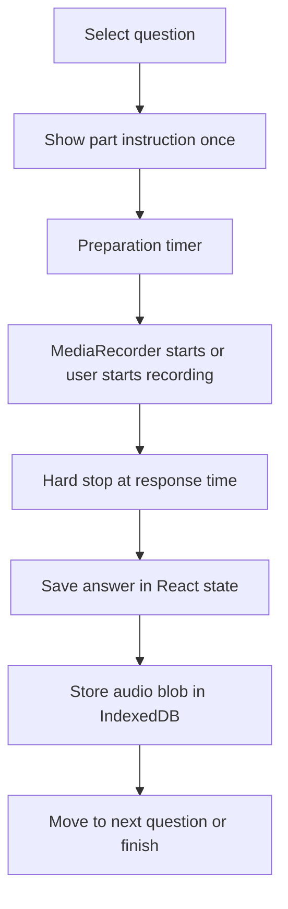
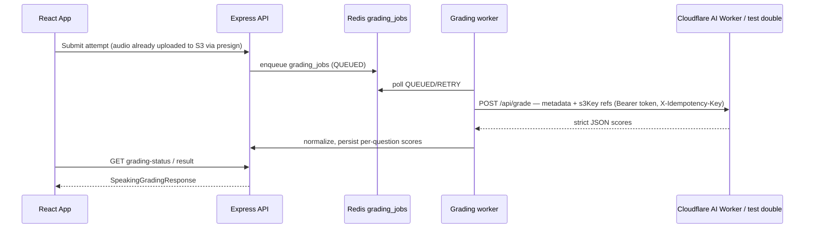
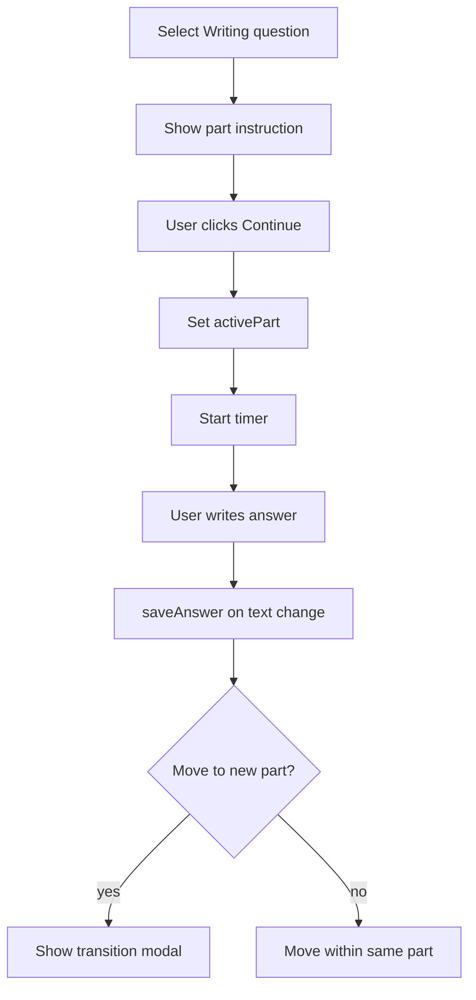
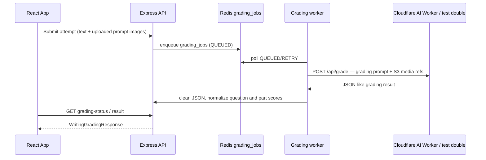

# Exam Workflows

> Updated: 2026-08-01 (R3-DOCS-FIX2 — legacy AI-provider/localStorage/serverless references removed)
> Goal: describe the real learner and grading flows as implemented, not as a generic product plan.

## 1. Entry Flow

The first screen is intentionally a catalog/selector, not a marketing page. The user must log in before practicing and choose an exam (Speaking/Writing) before seeing the question selector. Grading needs no client-side key: sessions ride an HttpOnly cookie (JWT with `jti` revocation in Redis), so no API key or token is ever stored in `localStorage` or sent in request bodies.

## 2. Speaking Flow

### 2.1 Selection

Source: `anish-toeic-web-app/src/modules/mock-exam/runner/sw/swStore.ts`, `.../runner/sw/SpeakingView.tsx`

The user starts with all Speaking questions selected:

- Part 1: Q1-Q2
- Part 2: Q3-Q4
- Part 3: Q5-Q7
- Part 4: Q8-Q10
- Part 5: Q11

They can toggle a single question or an entire part. The selector prevents selecting zero questions.

### 2.2 Question execution

Important implementation details:

- `runner/sw/MicrophoneSetup.tsx` + `SpeakingView.tsx` request microphone access through `navigator.mediaDevices.getUserMedia`.
- It tries codecs in order: `audio/webm;codecs=opus`, `audio/webm`, `audio/mp4`, `audio/ogg;codecs=opus`.
- It uses a hard timeout equal to the TOEIC response duration.
- It plays instruction/beep audio sourced from the exam catalog (`section.instructions`).
- It restores previously recorded audio from IndexedDB when the user switches back to a question.

### 2.3 Speaking grading

Grading is asynchronous and queued. The worker calls the AI provider over HTTP through `anish-toeic-web-services/src/services/adapters/ai-grading.adapter.ts` — production POSTs to the Cloudflare AI Worker (`CLOUDFLARE_AI_WORKER_URL`/`TOKEN`, endpoint `/api/grade`); `AI_GRADING_TEST_MODE=true` substitutes a deterministic test double (no network, no randomness). The adapter never carries audio or prompt images; it forwards only metadata and S3 keys for the Worker to fetch media itself.

The recoverable failure path is queue-aware. Retryable provider errors (timeout, 408/429/502/503/504) re-enqueue the job as `RETRY`, and per-question scores are persisted as they are produced, so a mid-job failure keeps the learner's completed work (`PARTIAL`) instead of returning a generic 500 after consuming the recorded answers.

## 3. Writing Flow

### 3.1 Selection

Source: `anish-toeic-web-app/src/modules/mock-exam/runner/sw/swStore.ts`, `.../runner/sw/WritingView.tsx`

Writing has 8 questions:

- Part 1: Q1-Q5, one sentence based on a picture.
- Part 2: Q6-Q7, email response.
- Part 3: Q8, opinion essay.

### 3.2 Timer and navigation

Timer logic:

| Part | Timer behavior |
|---|---|
| Part 1 | Shared 5-minute timer for Q1-Q5. |
| Part 2 | 10 minutes per question for Q6 and Q7. |
| Part 3 | 30-minute timer for Q8. |

Navigation is intentionally flexible before a part starts. Once the user clicks Continue, `activePart` restricts movement to the active part until the part is finished.

### 3.3 Writing grading

The backend returns:

- `overallScore`
- `partScores`
- criteria feedback
- `strengths`
- `weaknesses`
- optional `improvementTips`
- writing error spans with `start`, `end`, `type`, and `explanation`

## 4. Error and Edge Cases

| Case | Current behavior |
|---|---|
| Missing AI provider config | No `CLOUDFLARE_AI_WORKER_URL`/`TOKEN` and `AI_GRADING_TEST_MODE` off ⇒ `AiProviderNotConfiguredError` ⇒ job fails `AI_PROVIDER_NOT_CONFIGURED` (not retried). |
| Provider 4xx (auth, invalid request, model not found) | Non-retryable ⇒ job `FAILED` immediately. |
| Provider 429 / 5xx (quota, rate limit) | Retryable ⇒ job `RETRY`; per-question scores already persisted are kept (`PARTIAL`). |
| Provider timeout / network failure | Retryable ⇒ job `RETRY`; idempotency key prevents duplicate scoring. |
| HTTP microphone access | `MicrophoneSetup` warns that microphone access requires HTTPS or localhost. |
| Empty Speaking answers | UI blocks finishing with no recorded answers. |
| Empty Writing answers | UI blocks finishing with no written answers. |
| Image prompt missing | App still allows flow; grading quality depends on prompt text and uploaded image. |

## 5. Why the Flow Feels Different from a Classic LMS

Auth, attempts, and results are server-owned (MySQL + Redis), but there is no course tree or admin panel. Login is a session via HttpOnly cookie with `jti` revocation; the app behaves more like an exam cockpit backed by queued AI grading. That is a valid shape for a lightweight practice lab, but it should not be documented as a full learning management system.

If this becomes a production learning product, the next architectural step is not "more docs"; it is adding explicit backend ownership for rubric versions, AI model version pinning, and admin review of attempts and score history.
