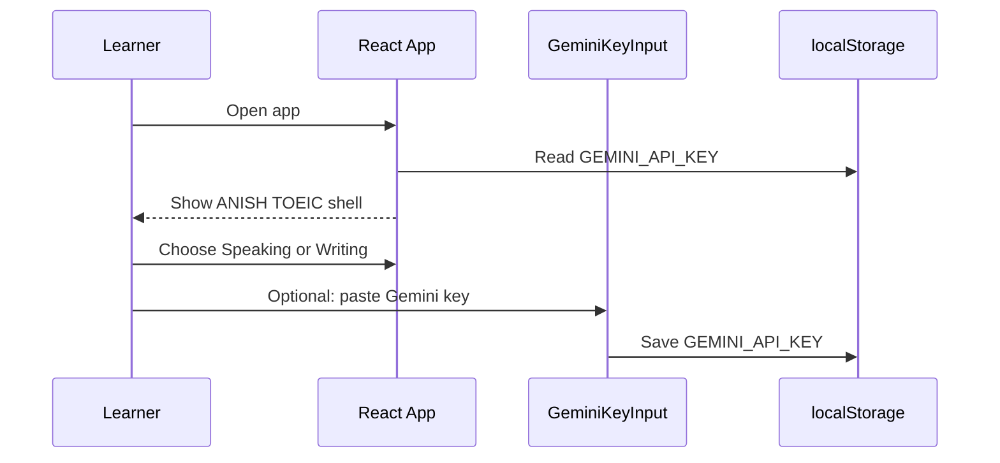
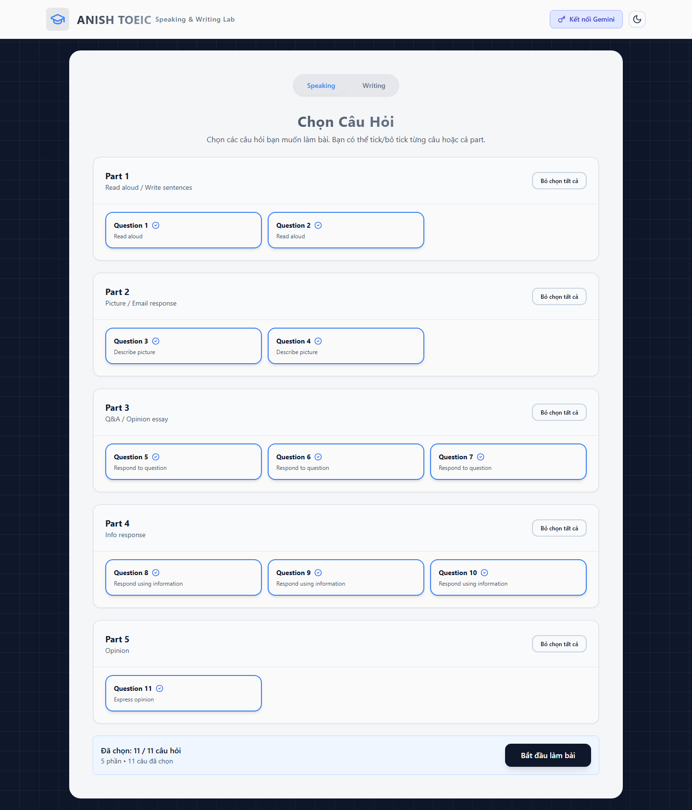
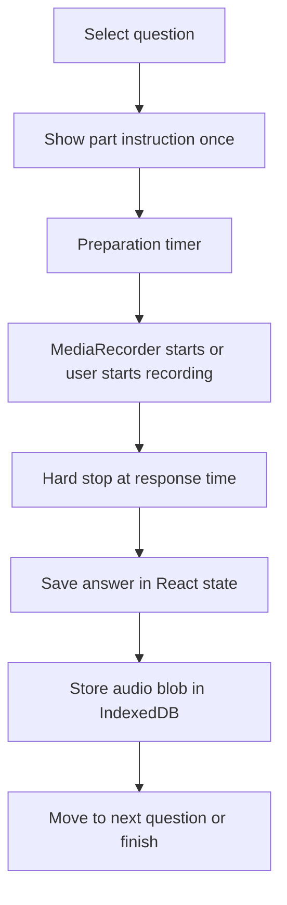
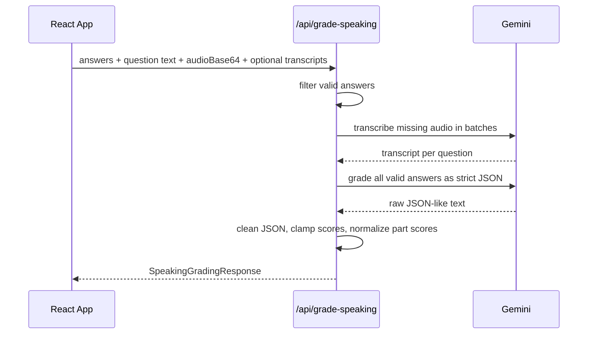
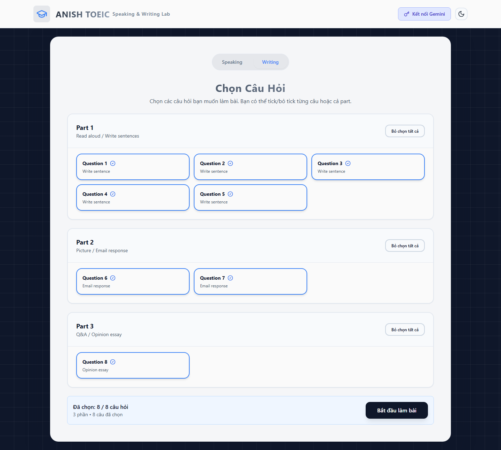
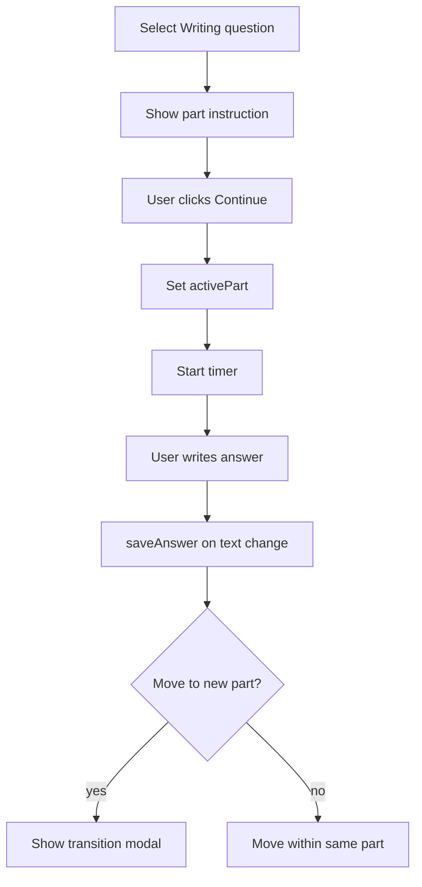
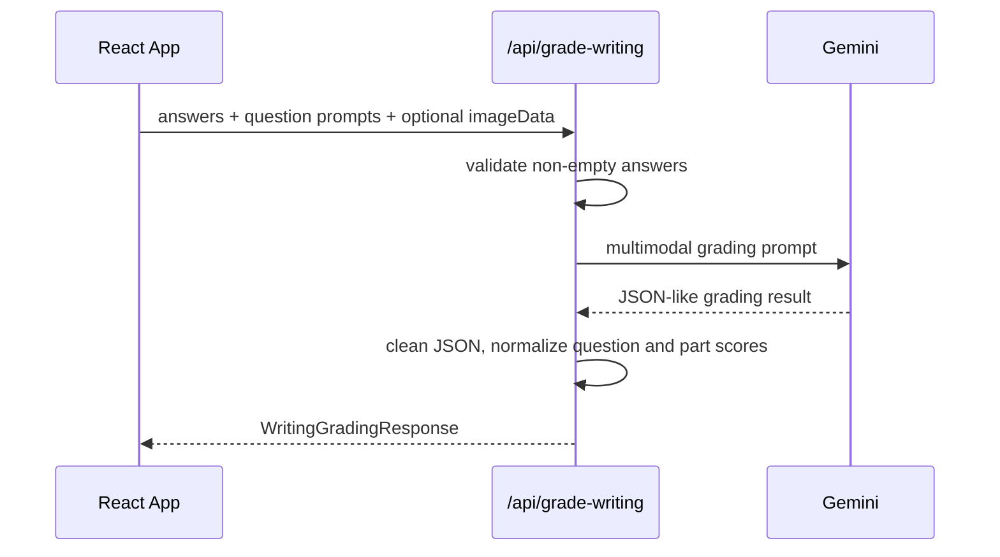

# Exam Workflows

> Updated: 2026-05-26
> Goal: describe the real learner and grading flows as implemented, not as a generic product plan.

## 1. Entry Flow

The first screen is intentionally a selector, not a marketing page. The user must choose Speaking or Writing before seeing the question selector. If the user wants to grade without server-side `GEMINI_API_KEY`, the UI modal is the only key entry path.

## 2. Speaking Flow

### 2.1 Selection

Source: `src/components/shared/QuestionSelector.tsx`, `src/contexts/SpeakingContext.tsx`

The user starts with all Speaking questions selected:

- Part 1: Q1-Q2
- Part 2: Q3-Q4
- Part 3: Q5-Q7
- Part 4: Q8-Q10
- Part 5: Q11

They can toggle a single question or an entire part. The selector prevents selecting zero questions.

### 2.2 Question execution

Important implementation details:

- `AudioRecorder.tsx` requests microphone access through `navigator.mediaDevices.getUserMedia`.
- It tries codecs in order: `audio/webm;codecs=opus`, `audio/webm`, `audio/mp4`, `audio/ogg;codecs=opus`.
- It uses a hard timeout equal to the TOEIC response duration.
- It plays static beep/instruction audio through URLs from `src/lib/speakingAudio.ts`.
- It restores previously recorded audio from IndexedDB when the user switches back to a question.

### 2.3 Speaking grading

The recoverable failure path is quota-aware. If transcription hits quota after some questions are done, the API can return partial transcript data and tell the frontend which questions failed. That is better than returning a generic 500 after consuming the user's recorded work.

## 3. Writing Flow

### 3.1 Selection

Source: `src/components/shared/QuestionSelector.tsx`, `src/contexts/WritingContext.tsx`

Writing has 8 questions:

- Part 1: Q1-Q5, one sentence based on a picture.
- Part 2: Q6-Q7, email response.
- Part 3: Q8, opinion essay.

### 3.2 Timer and navigation

Timer logic:

| Part | Timer behavior |
|---|---|
| Part 1 | Shared 5-minute timer for Q1-Q5. |
| Part 2 | 10 minutes per question for Q6 and Q7. |
| Part 3 | 30-minute timer for Q8. |

Navigation is intentionally flexible before a part starts. Once the user clicks Continue, `activePart` restricts movement to the active part until the part is finished.

### 3.3 Writing grading

The backend returns:

- `overallScore`
- `partScores`
- criteria feedback
- `strengths`
- `weaknesses`
- optional `improvementTips`
- writing error spans with `start`, `end`, `type`, and `explanation`

## 4. Error and Edge Cases

| Case | Current behavior |
|---|---|
| Missing Gemini key | API uses request key first, then env key; without either, Gemini call fails. |
| Invalid Gemini key | Mapped to `API_KEY_INVALID`. |
| Gemini quota/rate limit | Mapped to `RATE_LIMIT`; Speaking transcription can return partial progress. |
| Model not found | Model chain can fall back on 404/503; terminal 404 maps to `MODEL_NOT_FOUND`. |
| HTTP microphone access | `AudioRecorder` warns that microphone access requires HTTPS or localhost. |
| Empty Speaking answers | UI blocks finishing with no recorded answers. |
| Empty Writing answers | UI blocks finishing with no written answers. |
| Image prompt missing | App still allows flow; grading quality depends on prompt text and uploaded image. |

## 5. Why the Flow Feels Different from a Classic LMS

There is no login, course tree, database submission history, or admin panel. The app behaves more like a local exam cockpit backed by AI grading. That is a valid shape for a lightweight practice lab, but it should not be documented as a full learning management system.

If this becomes a production learning product, the next architectural step is not "more docs"; it is adding explicit backend ownership for users, attempts, rubric versions, AI model versions, and score history.
